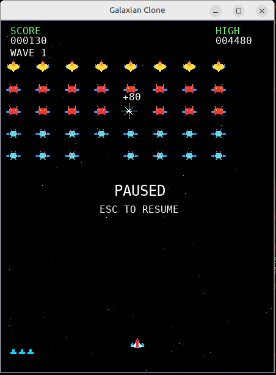

# Galaxian Clone

**A blazing fast arcade classic, reborn in the stars.**

The void is no longer silent. Waves of alien squadrons descend from the
dark, their hulls glinting in the embers of a distant starfield, peeling
away from their formation to dive at you with a hunter's precision. You are
the last pilot at the bottom of the screen — a lone fighter with a single
gun, a handful of lives, and every intention of surviving the night.

This is **Galaxian Clone**, a faithful C++20/SDL2 tribute to the arcade-era
Galaxian. Outrun the relentless tide, thread fire through their ranks, and
push deeper into waves that grow faster, meaner, and more determined with
every victory. The classic gameplay feel is the target; the pixels, the
explosions, and the chase are ours.



## Status

**v1.0.0 released.** The complete 26-stage development plan is implemented,
tested, and shipped. See `docs/game_spec.md`, `docs/architecture.md`,
`docs/test_plan.md`, and `docs/regression_checklist.md`.

## Features

- 5×8 enemy formation (scouts, guards, commanders) that oscillates and
  speeds up as it thins out
- Cubic-Bézier dive paths and aimed enemy fire
- Player lives, death, respawn with invulnerability blink
- Scoring with `+N` popups (2× for diving enemies)
- Bounded wave progression with a WAVE CLEAR interstitial
- Title / pause / game-over states with clean restart
- HUD: score, high score, life pips, wave
- Hand-authored reference-matched pixel art, explosions, and parallax
  starfield
- Procedural sound effects + background music (silent fallback)
- Local high-score persistence and data-driven balance
  (`assets/config/game.json`)
- 204 automated tests green on GCC Debug/Release, Clang, and ASan+UBSan;
  0 sanitizer errors; 0 Valgrind leaks

## Requirements

- Linux
- CMake ≥ 3.20
- GCC or Clang with C++20 support
- SDL2 development packages (`libsdl2-dev`, `libsdl2-ttf-dev`,
  `libsdl2-mixer-dev` on Debian/Ubuntu)

## Build and run

```bash
cmake -S . -B build
cmake --build build
./build/galaxian
```

Useful build types:

```bash
cmake -S . -B build -DCMAKE_BUILD_TYPE=Release     # optimized
cmake -S . -B build -DCMAKE_BUILD_TYPE=Sanitize    # ASan + UBSan
cmake -S . -B build-clang -DCMAKE_CXX_COMPILER=clang++
```

## Controls

| Key              | Action            |
|------------------|-------------------|
| Left / A         | Move left         |
| Right / D        | Move right        |
| Space            | Fire              |
| Enter            | Start             |
| Escape           | Pause / quit      |
| F1               | Collision debug   |
| F2               | Debug overlay     |
| F3               | Manual enemy dive |

## Developer notes

- Logical resolution is 448×576; the window scales it (integer scale,
  letterboxed).
- The simulation runs at a fixed 1/60 s timestep; render rate never changes
  gameplay speed.
- Headless smoke runs (no display needed):

  ```bash
  SDL_VIDEODRIVER=dummy ./build/galaxian --smoke 120          # N frames
  SDL_VIDEODRIVER=dummy ./build/galaxian --smoke-time 5       # N seconds
  SDL_VIDEODRIVER=dummy ./build/galaxian --smoke-time 5 --no-vsync
  ```

- Unit tests: `ctest --test-dir build` (Catch2, fetched at configure time).
- Warning policy: `-Wall -Wextra -Wpedantic`, zero warnings.

## Credits

This game was **ported to C++ for Linux by AI language models** — **Qwen
3.8 / 27B** and **DeepSeek V4 Flash-0731** — working incrementally through
the full 26-stage plan. Original assets and names; all code is original.

## License

Licensed under the **Apache License, Version 2.0**. See the
[`LICENSE`](LICENSE) file for the full text.
